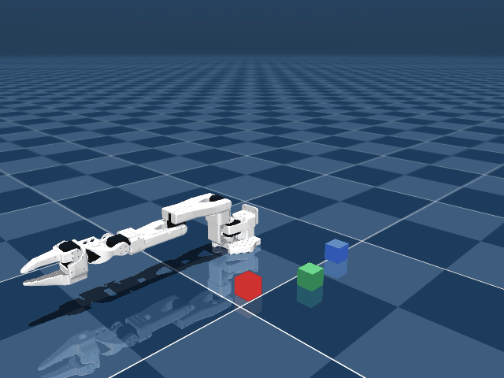

# 03-digital-twin — SO-100 디지털 트윈 (MuJoCo, sim, 하드웨어 불필요)

> `experiments/03-digital-twin/README.md` — M6 디지털 트윈의 1차 산출물(PoC).
> 거버넌스: [ADR 0004](../../docs/adr/0004-digital-twin-stack.md) — 트윈 스택 선택(SO-100 MJCF + MuJoCo WASM 웹 replay, 정책 replay-first).
> 짝: M7 실물([ADR 0002](../../docs/adr/0002-act-deferred-to-m6.md) — ACT는 실물 모방학습 자리).

저가 로봇팔 SO-100을 **사기 전에** sim에 세우고, consumer Windows에서 정책 롤아웃을 렌더해 포트폴리오로
보여주는 게 목표. 하드웨어 없이 sim→real 직전까지.



## 1. 목표

- SO-100(`trs_so_arm100`) MJCF를 MuJoCo에 로드해 **6관절(Rotation·Pitch·Elbow·Wrist_Pitch·Wrist_Roll·Jaw)** 트윈을 세운다.
- consumer Windows에서 **오프스크린 GL 렌더**로 움직이는 트윈 영상(mp4/gif)을 낸다 — 웹/README 임베드용.
- 다음 단계(웹 인터랙티브 3D = MuJoCo WASM, 정책 학습)의 기반 자산을 레포에 고정한다.

## 2. 방법

- **모델**: MuJoCo Menagerie(DeepMind 큐레이션) `trs_so_arm100`. `setup.sh`가 sparse-checkout으로 그 폴더만 받아
  `vendor/`(비트래킹)에 둔다. 커스텀 씬 [`scene_twin.xml`](scene_twin.xml)이 `<include>`로 모델을 불러오고
  색 블록 3개(집기 태스크 맥락) + 고해상도 offscreen 프레임버퍼(1280×960)를 더한다.
- **모션**: 현재는 **replay-first** — 학습된 정책이 아니라, 관절 한계 내 위상차 사인파 sweep([`render_twin.py`](render_twin.py)).
  실제 정책 롤아웃 replay·ACT sim-학습은 후속(ADR 0004 Decision §2).
- **렌더**: `mujoco.Renderer` 오프스크린(창 없음). Windows 네이티브 GL에서 동작 — WSL 우회 불필요.

```bash
bash setup.sh                          # SO-100 모델 다운로드 (vendor/, 1회)
pip install -r requirements.txt        # mujoco·imageio
python smoke_twin.py                   # 빠른 헤드리스 게이트 (로드+FK+액추에이션), exit 0 = PASS
python render_twin.py                  # media/so100_twin.mp4 생성
```

## 3. 결과

- **로드 스모크 PASS** (`smoke_twin.py`): nq=6, nu=6, FK 풀림, ctrl 인가 시 Moving_Jaw |Δ|≈0.14m 이동.
- **렌더 PASS** (`render_twin.py`): 1280×960, 180프레임/6초 mp4. Windows 오프스크린 GL 정상.
- 산출물: [`media/so100_twin.mp4`](media/so100_twin.mp4) (고화질) + [`media/so100_twin.gif`](media/so100_twin.gif) (README 임베드용).

## 4. 통찰 / 한계 (정직)

- ✅ **하드웨어·GPU-시간 없이** "움직이는 SO-100 트윈" showable artifact가 나온다 — M6를 구매 게이트에서 떼어낸 게 유효.
- ✅ Menagerie `trs_so_arm100`는 **메인에 정식 포함**(검증 2026-06-12) — 깨끗한 큐레이션 모델을 1차로 씀.
- ⚠ **지금 모션은 정책이 아니라 sweep(replay-first)** — "정책이 추론하며 집는" 게 아님. 데모로는 충분하나 *live policy*는 아님(ADR 0004 trade-off).
- ⚠ 블록은 **정적 geom**(집기 물리 X) — 태스크 맥락 연출용. 실제 pick-and-place는 free-joint + 그리퍼 접촉이 필요.
- ▶ 다음: (C) [zalo/mujoco_wasm](https://github.com/zalo/mujoco_wasm)로 같은 MJCF를 **브라우저 인터랙티브 3D**로 (웹에서 도는 트윈). 그 위에 정책 롤아웃 replay.

## 출처

- 모델: [google-deepmind/mujoco_menagerie · trs_so_arm100](https://github.com/google-deepmind/mujoco_menagerie/tree/main/trs_so_arm100) (Apache-2.0, 접근 2026-06-12)
- 원본 팔: [TheRobotStudio/SO-ARM100](https://github.com/TheRobotStudio/SO-ARM100) (Apache-2.0)
- 참조 트윈 구현: [lachlanhurst/so100-mujoco-sim](https://github.com/lachlanhurst/so100-mujoco-sim) (MIT)
- vault: `10-Resources/10.10-Research/physical-ai/so100-digital-twin-stack-2026-06-12.md`
