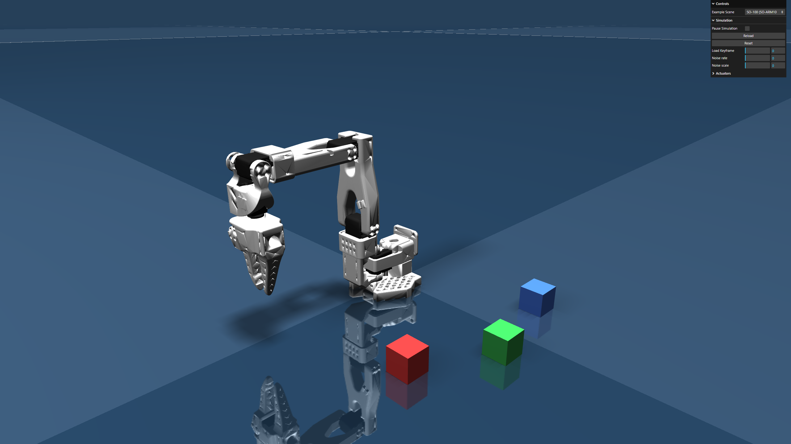
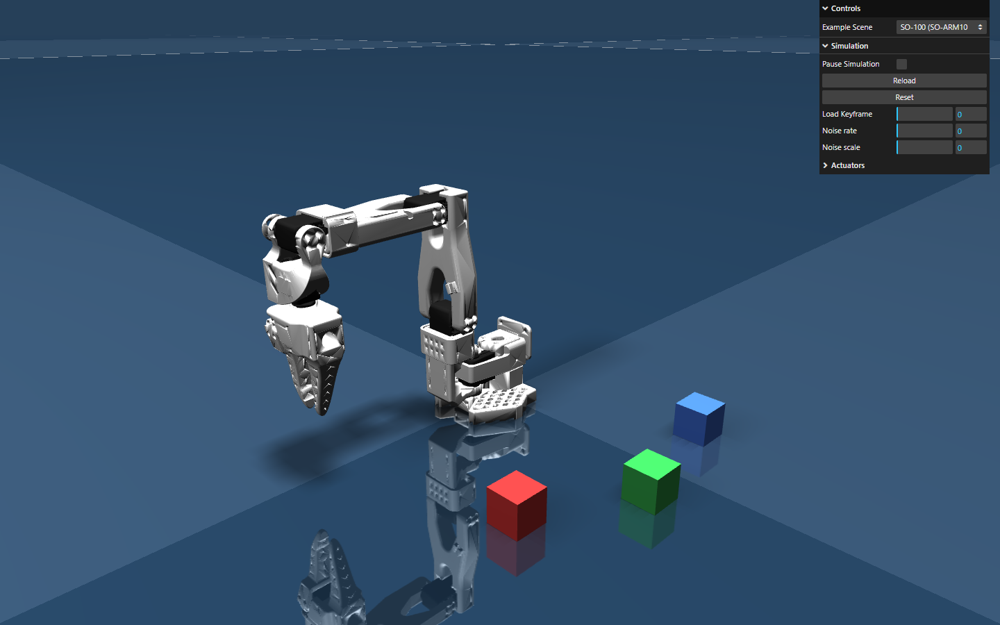
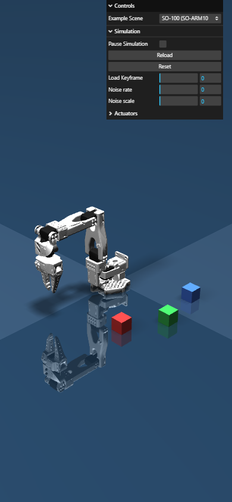

# SO-100 트윈 — 웹 인터랙티브 3D (MuJoCo WASM)

같은 SO-100 MJCF를 **브라우저에서 실제 물리째** 돌리는 인터랙티브 트윈. DeepMind 공식 MuJoCo WASM
바인딩(`mujoco-js`) + three.js. 빌드·node_modules 불필요 — deps는 jsDelivr CDN, ES module 직접 로드(순수 정적).

**라이브: https://physical-ai-arm.askewly.com**



| 노트북 (1440) | 모바일 (390) |
|---|---|
|  |  |

- 로드 시 `home` 키프레임으로 팔이 직립(position 액추에이터가 자세 유지).
- 시점 궤도/드래그/`Actuators` 슬라이더로 관절 직접 구동(물리 라이브).
- 반응형: 세로(모바일)에선 카메라를 뒤로 빼 팔 전체를 프레이밍, 좁은 화면에선 컨트롤 패널 축소.

## 로컬 실행

```bash
python serve_coi.py 8132    # COOP/COEP 헤더 필요 (WASM). deps는 CDN이라 install 불필요
# http://127.0.0.1:8132/index.html
```

> 일반 정적 서버(`python -m http.server`)로는 안 됨 — MuJoCo WASM이 cross-origin isolation
> (COOP `same-origin` + COEP `require-corp`)을 요구한다. `serve_coi.py`가 그 헤더를 붙인다.
> three/mujoco-js는 jsDelivr CDN에서 로드되므로 인터넷 필요(install·node_modules 없음).
> `package.json`은 버전 고정 기록용(CDN URL의 버전과 일치).

## 배포 (Vercel)

순수 정적 — 빌드 없음. [`vercel.json`](vercel.json)이 COOP/COEP 헤더만 설정. `web/`를 루트로 올리면 끝.
(이 레포는 REST API 직접 업로드로 배포: [`deploy_vercel.py`](deploy_vercel.py), `VERCEL_TOKEN` env 필요.)

## upstream 대비 변경

베이스: [zalo/mujoco_wasm](https://github.com/zalo/mujoco_wasm) (ISC). 우리 delta는 [`mujoco_wasm.patch`](mujoco_wasm.patch):
1. `src/mujocoUtils.js` — 씬 목록·`allFiles`를 SO-100 단일로 트림.
2. `src/main.js` — 시작 씬 = SO-100, `home` 키프레임 주입, SO-100 스케일·반응형 카메라.
3. `index.html` — 모바일 컨트롤 패널 축소 CSS.

추가: `assets/scenes/trs_so_arm100/`(Menagerie 모델 + 우리 `scene_twin.xml`).

## 출처 / 라이선스

- 엔진/뷰어: [zalo/mujoco_wasm](https://github.com/zalo/mujoco_wasm) (ISC), [mujoco-js](https://www.npmjs.com/package/mujoco-js)(DeepMind 공식 WASM 바인딩), [three.js](https://threejs.org) (MIT)
- 모델: [mujoco_menagerie/trs_so_arm100](https://github.com/google-deepmind/mujoco_menagerie/tree/main/trs_so_arm100) (Apache-2.0)
- 상위 실험: [../README.md](../README.md) · 결정: [ADR 0004](../../../docs/adr/0004-digital-twin-stack.md)
